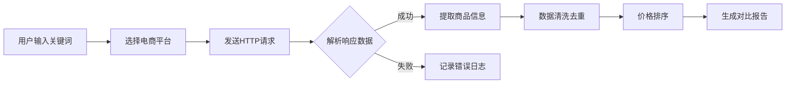
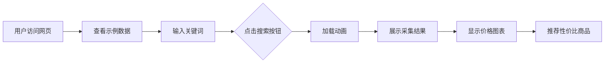

# 电商商品价格采集与对比工具 - 产品需求文档

## 1. 产品概述

**PriceScout** - 智能电商价格采集与横向对比工具

帮助消费者和商家快速采集主流电商平台(京东、淘宝、拼多多)的商品信息,实现价格对比分析、性价比推荐和可视化展示。

### 核心价值
- **批量采集**: 支持多平台、多关键词批量抓取商品数据
- **智能对比**: 自动清洗去重,按价格排序,标注性价比
- **可视化呈现**: 图表展示价格趋势和对比结果
- **即时演示**: 提供网页端实时演示,所见即所得

---

## 2. 核心功能

### 2.1 用户角色
| 角色 | 使用场景 | 核心功能 |
|------|----------|----------|
| 普通消费者 | 比价购物 | 搜索商品、查看价格、获取推荐 |
| 商家/分析师 | 市场调研 | 批量采集、数据导出、趋势分析 |

### 2.2 功能模块

#### 2.2.1 命令行工具 (CLI)
- 关键词搜索采集
- 多平台并行抓取
- 数据清洗与去重
- JSON/CSV 格式导出
- 价格排序与筛选

#### 2.2.2 网页演示工具 (Web)
- 实时搜索演示
- 数据表格展示
- 价格对比图表
- 性价比推荐卡片
- 历史数据模拟

### 2.3 页面详情

#### 命令行工具页面 (CLI Tool)
| 模块 | 功能描述 |
|------|----------|
| 搜索模块 | 输入关键词,支持多平台选择 |
| 采集模块 | 并行抓取多平台商品数据 |
| 处理模块 | 数据清洗、去重、排序 |
| 导出模块 | JSON/CSV格式导出结果 |
| 报告模块 | 生成对比报告和推荐列表 |

#### 网页演示页面 (Web Demo)
| 模块 | 功能描述 |
|------|----------|
| Hero区域 | 工具介绍、核心价值展示 |
| 搜索区域 | 关键词输入、平台选择、执行按钮 |
| 结果表格 | 商品列表、价格、销量、评分、链接 |
| 图表区域 | 价格分布柱状图、销量饼图、性价比散点图 |
| 推荐卡片 | 性价比TOP商品推荐 |

---

## 3. 核心流程

### 3.1 数据采集流程


### 3.2 网页交互流程


---

## 4. 用户界面设计

### 4.1 设计风格

#### 视觉风格
- **主题**: 现代科技感 + 数据可视化专业风格
- **色调**: 深蓝主色(#1a1a2e) + 科技蓝(#0066ff) + 渐变强调色
- **布局**: 卡片式布局,清晰的信息层级

#### 配色方案
- **主色**: #1a1a2e (深海蓝)
- **次色**: #16213e (午夜蓝)
- **强调色**: #0066ff (科技蓝)
- **辅助色**: #00d9ff (青色)
- **成功色**: #00ff88 (亮绿 - 推荐/低价)
- **警告色**: #ff6b6b (珊瑚红 - 高价)
- **背景色**: #0f0f23 (深空黑)
- **文字色**: #ffffff (白色) + #a0a0a0 (灰色)

#### 字体选择
- **标题**: "Orbitron", "Rajdhani" (科技感字体)
- **正文**: "Inter", "Noto Sans SC" (清晰易读)
- **数据**: "JetBrains Mono", monospace (等宽数字)

#### 交互动效
- 卡片悬浮: scale(1.02) + box-shadow增强
- 数据加载: 骨架屏 + 脉冲动画
- 图表渲染: 渐进式绘制动画
- 按钮交互: 渐变位移 + 发光效果

### 4.2 页面设计

#### 主页/演示页布局
```
┌─────────────────────────────────────────┐
│  Header: Logo + 导航 + GitHub链接       │
├─────────────────────────────────────────┤
│  Hero区域                                │
│  - 标题: PriceScout 智能比价工具         │
│  - 副标题: 采集 · 对比 · 推荐            │
│  - 背景: 动态粒子/网格效果              │
├─────────────────────────────────────────┤
│  搜索控制区                              │
│  - 关键词输入框                          │
│  - 平台选择复选框 (京东/淘宝/拼多多)     │
│  - 搜索按钮                              │
├─────────────────────────────────────────┤
│  数据展示区                              │
│  ┌─────────────┬─────────────┐          │
│  │ 商品表格    │ 价格图表    │          │
│  │ - 排序     │ - 柱状图    │          │
│  │ - 筛选     │ - 饼图      │          │
│  └─────────────┴─────────────┘          │
├─────────────────────────────────────────┤
│  推荐区                                  │
│  - 性价比TOP3商品卡片                    │
│  - 价格趋势分析                          │
├─────────────────────────────────────────┤
│  Footer: 版权信息 + 技术栈说明           │
└─────────────────────────────────────────┘
```

#### 商品卡片设计
```
┌─────────────────────────────────┐
│ [平台图标]  商品名称            │
│  ¥299.00    ⭐4.8 (1.2万条)     │
│  ───────────────────────────    │
│  销量: 2.3万  店铺: xxx旗舰店   │
│  [查看详情]  [前往购买]        │
│  🏷️ 性价比推荐                  │
└─────────────────────────────────┘
```

### 4.3 响应式设计
- **桌面优先** (>1200px): 完整三栏布局
- **平板适配** (768-1200px): 两栏布局,图表堆叠
- **移动端** (<768px): 单栏布局,卡片全宽

---

## 5. 数据指标

### 5.1 商品数据字段
| 字段 | 类型 | 描述 |
|------|------|------|
| id | string | 商品唯一标识 |
| name | string | 商品名称 |
| price | number | 现价(元) |
| originalPrice | number | 原价(元) |
| sales | number | 销量 |
| rating | number | 评分(0-5) |
| platform | string | 平台来源 |
| store | string | 店铺名称 |
| url | string | 商品链接 |
| thumbnail | string | 商品图片 |
| scrapedAt | datetime | 采集时间 |

### 5.2 分析指标
- **价格区间分布**: 0-100, 100-300, 300-500, 500-1000, 1000+
- **平均价格**: 各平台平均售价
- **性价比指数**: (评分 × 销量) / 价格
- **价格竞争力**: 低于平均价的百分比

---

## 6. 示例数据

### 6.1 示例关键词
- "无线蓝牙耳机"
- "机械键盘"
- "运动鞋"

### 6.2 示例结果结构
```json
{
  "keyword": "无线蓝牙耳机",
  "total": 45,
  "platforms": {
    "jd": 15,
    "taobao": 20,
    "pdd": 10
  },
  "products": [...],
  "summary": {
    "lowestPrice": 29.9,
    "highestPrice": 999,
    "avgPrice": 189.5,
    "topRecommendation": {...}
  }
}
```

---

## 7. 验收标准

### 功能验收
- ✅ 支持关键词搜索采集
- ✅ 支持京东、淘宝、拼多多三平台
- ✅ 数据包含: 名称、价格、销量、评分、链接
- ✅ 自动去重和价格排序
- ✅ 生成价格对比图表
- ✅ 标注性价比推荐
- ✅ 支持命令行执行
- ✅ 支持网页端演示
- ✅ 提供示例数据

### 视觉验收
- ✅ 深色科技风格界面
- ✅ 流畅的加载动画
- ✅ 清晰的数据可视化
- ✅ 响应式布局适配
- ✅ 专业的数据展示卡片
