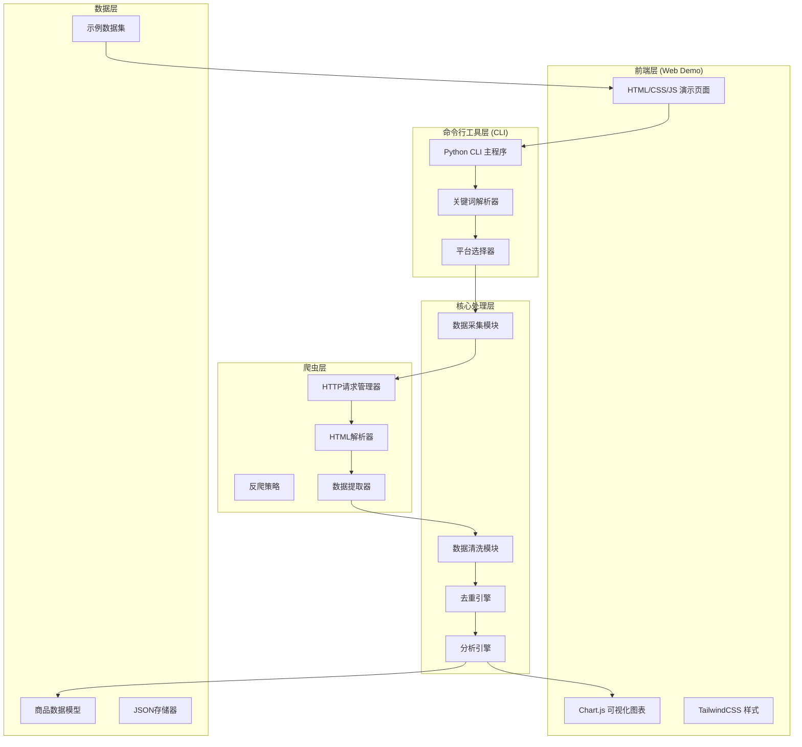

# 电商商品价格采集与对比工具 - 技术架构文档

## 1. 架构设计

### 1.1 整体架构图


### 1.2 技术栈

#### 命令行工具
- **语言**: Python 3.8+
- **核心库**:
  - `requests` - HTTP请求
  - `beautifulsoup4` - HTML解析
  - `lxml` - 快速XML/HTML解析
  - `click` - CLI框架
  - `colorama` - 彩色输出
  - `tabulate` - 表格格式化
  - `json` - 数据序列化

#### 网页演示
- **前端**: 原生HTML5 + CSS3 + JavaScript ES6+
- **样式**: TailwindCSS 3.0
- **图表**: Chart.js 4.0
- **图标**: Font Awesome 6.0
- **字体**: Google Fonts (Orbitron, Inter, JetBrains Mono)

---

## 2. 目录结构

```
d:\solo项目\
├── README.md                    # 项目说明
├── requirements.txt             # Python依赖
├── cli.py                       # 命令行工具入口
├── web-demo.html               # 网页演示页面
├── sample_data.json            # 示例数据
│
├── src/                        # 源代码目录
│   ├── __init__.py
│   ├── scraper/               # 爬虫模块
│   │   ├── __init__.py
│   │   ├── base_scraper.py    # 爬虫基类
│   │   ├── jd_scraper.py      # 京东爬虫
│   │   ├── taobao_scraper.py  # 淘宝爬虫
│   │   └── pdd_scraper.py     # 拼多多爬虫
│   │
│   ├── processor/             # 数据处理模块
│   │   ├── __init__.py
│   │   ├── cleaner.py         # 数据清洗
│   │   ├── deduplicator.py    # 去重引擎
│   │   └── analyzer.py        # 分析引擎
│   │
│   ├── models/                # 数据模型
│   │   ├── __init__.py
│   │   └── product.py         # 商品模型
│   │
│   └── utils/                 # 工具函数
│       ├── __init__.py
│       ├── http_client.py     # HTTP客户端
│       └── formatters.py       # 格式化工具
│
├── docs/                       # 文档目录
│   ├── architecture.md        # 架构文档
│   └── api_reference.md       # API参考
│
└── tests/                      # 测试目录
    ├── __init__.py
    ├── test_scraper.py        # 爬虫测试
    └── test_processor.py      # 处理模块测试
```

---

## 3. 核心模块设计

### 3.1 商品数据模型

```python
# src/models/product.py
from dataclasses import dataclass, asdict
from datetime import datetime
from typing import Optional
from enum import Enum

class Platform(Enum):
    JD = "jd"
    TAOBAO = "taobao"
    PDD = "pdd"

@dataclass
class Product:
    """商品数据模型"""
    id: str
    name: str
    price: float
    original_price: Optional[float] = None
    sales: int = 0
    rating: float = 0.0
    platform: str = ""
    store: str = ""
    url: str = ""
    thumbnail: str = ""
    scraped_at: str = ""

    def __post_init__(self):
        if not self.scraped_at:
            self.scraped_at = datetime.now().isoformat()
        if not self.id:
            self.id = f"{self.platform}_{hash(self.name)}"

    def to_dict(self):
        return asdict(self)

    def get_value_score(self) -> float:
        """计算性价比指数: (评分 * 销量) / 价格"""
        if self.price <= 0:
            return 0
        return (self.rating * max(self.sales, 1)) / self.price
```

### 3.2 爬虫基类

```python
# src/scraper/base_scraper.py
from abc import ABC, abstractmethod
from typing import List, Dict, Optional
import requests
from bs4 import BeautifulSoup
from ..models.product import Product

class BaseScraper(ABC):
    """爬虫基类"""

    def __init__(self, platform: str):
        self.platform = platform
        self.headers = {
            'User-Agent': 'Mozilla/5.0 (Windows NT 10.0; Win64; x64) AppleWebKit/537.36',
            'Accept': 'text/html,application/xhtml+xml,application/xml;q=0.9,*/*;q=0.8',
        }
        self.session = requests.Session()

    @abstractmethod
    def search_url(self, keyword: str, page: int = 1) -> str:
        """生成搜索URL"""
        pass

    @abstractmethod
    def parse_product(self, item) -> Optional[Product]:
        """解析单个商品"""
        pass

    def fetch_page(self, url: str) -> Optional[str]:
        """获取页面内容"""
        try:
            response = self.session.get(url, headers=self.headers, timeout=10)
            response.raise_for_status()
            return response.text
        except Exception as e:
            print(f"请求失败: {e}")
            return None

    def scrape(self, keyword: str, max_pages: int = 3) -> List[Product]:
        """采集商品"""
        products = []
        for page in range(1, max_pages + 1):
            url = self.search_url(keyword, page)
            html = self.fetch_page(url)
            if html:
                soup = BeautifulSoup(html, 'lxml')
                items = self.extract_items(soup)
                for item in items:
                    product = self.parse_product(item)
                    if product:
                        products.append(product)
        return products

    @abstractmethod
    def extract_items(self, soup: BeautifulSoup):
        """提取商品列表"""
        pass
```

### 3.3 数据清洗模块

```python
# src/processor/cleaner.py
import re
from typing import List
from ..models.product import Product

class DataCleaner:
    """数据清洗器"""

    @staticmethod
    def clean_price(price_str: str) -> float:
        """清洗价格字符串"""
        if not price_str:
            return 0.0
        # 移除非数字和小数点
        price_str = re.sub(r'[^\d.]', '', price_str)
        try:
            return float(price_str)
        except:
            return 0.0

    @staticmethod
    def clean_sales(sales_str: str) -> int:
        """清洗销量字符串"""
        if not sales_str:
            return 0
        # 处理万、亿单位
        sales_str = sales_str.upper()
        multiplier = 1
        if '万' in sales_str:
            multiplier = 10000
            sales_str = sales_str.replace('万', '')
        elif '亿' in sales_str:
            multiplier = 100000000
            sales_str = sales_str.replace('亿', '')

        numbers = re.findall(r'\d+', sales_str)
        if numbers:
            return int(numbers[0]) * multiplier
        return 0

    @staticmethod
    def clean_rating(rating_str: str) -> float:
        """清洗评分字符串"""
        if not rating_str:
            return 0.0
        numbers = re.findall(r'\d+\.?\d*', rating_str)
        if numbers:
            rating = float(numbers[0])
            # 评分应该在0-5范围
            if rating > 5:
                rating = rating / 20  # 处理100分制
            return min(5.0, max(0.0, rating))
        return 0.0

    @staticmethod
    def clean_name(name: str) -> str:
        """清洗商品名称"""
        if not name:
            return ""
        # 移除非必要字符,保留中文、英文、数字
        name = re.sub(r'[^\u4e00-\u9fa5a-zA-Z0-9\s]', '', name)
        return name.strip()

    def clean_product(self, product: Product) -> Product:
        """清洗单个商品"""
        product.price = self.clean_price(str(product.price))
        product.original_price = self.clean_price(str(product.original_price))
        product.sales = self.clean_sales(str(product.sales))
        product.rating = self.clean_rating(str(product.rating))
        product.name = self.clean_name(product.name)
        return product

    def clean_products(self, products: List[Product]) -> List[Product]:
        """批量清洗商品"""
        return [self.clean_product(p) for p in products]
```

### 3.4 去重引擎

```python
# src/processor/deduplicator.py
from typing import List, Dict
from ..models.product import Product
import re

class Deduplicator:
    """商品去重引擎"""

    def __init__(self, similarity_threshold: float = 0.8):
        self.threshold = similarity_threshold

    def normalize_name(self, name: str) -> str:
        """标准化商品名称"""
        # 转小写,移除非字母数字
        name = name.lower()
        name = re.sub(r'[^a-z0-9\u4e00-\u9fa5]', '', name)
        return name

    def calculate_similarity(self, name1: str, name2: str) -> float:
        """计算名称相似度(简单实现:最长公共子序列)"""
        s1 = self.normalize_name(name1)
        s2 = self.normalize_name(name2)

        if not s1 or not s2:
            return 0.0

        # 简单相似度: 公共字符占比
        common = set(s1) & set(s2)
        total = set(s1) | set(s2)
        return len(common) / len(total) if total else 0

    def is_duplicate(self, p1: Product, p2: Product) -> bool:
        """判断两个商品是否重复"""
        # 1. 完全相同名称
        if p1.name == p2.name:
            return True

        # 2. 名称高度相似
        if self.calculate_similarity(p1.name, p2.name) >= self.threshold:
            # 且价格相近(差异<20%)
            if p1.price and p2.price:
                price_diff = abs(p1.price - p2.price) / max(p1.price, p2.price)
                if price_diff < 0.2:
                    return True

        return False

    def deduplicate(self, products: List[Product]) -> List[Product]:
        """去重处理"""
        if not products:
            return []

        unique_products = []
        for product in products:
            is_dup = False
            for existing in unique_products:
                if self.is_duplicate(product, existing):
                    # 保留评分和销量更高的
                    if (product.rating * product.sales) > (existing.rating * existing.sales):
                        unique_products.remove(existing)
                        unique_products.append(product)
                    is_dup = True
                    break
            if not is_dup:
                unique_products.append(product)

        return unique_products
```

### 3.5 分析引擎

```python
# src/processor/analyzer.py
from typing import List, Dict, Tuple
from ..models.product import Product
from collections import defaultdict

class ProductAnalyzer:
    """商品分析引擎"""

    @staticmethod
    def sort_by_price(products: List[Product], ascending: bool = True) -> List[Product]:
        """按价格排序"""
        return sorted(products, key=lambda p: p.price if p.price else float('inf'), reverse=not ascending)

    @staticmethod
    def filter_by_price_range(products: List[Product], min_price: float, max_price: float) -> List[Product]:
        """按价格区间筛选"""
        return [p for p in products if min_price <= (p.price or 0) <= max_price]

    @staticmethod
    def calculate_statistics(products: List[Product]) -> Dict:
        """计算统计信息"""
        prices = [p.price for p in products if p.price]
        if not prices:
            return {}

        return {
            'count': len(products),
            'min_price': min(prices),
            'max_price': max(prices),
            'avg_price': sum(prices) / len(prices),
            'total_sales': sum(p.sales for p in products),
            'avg_rating': sum(p.rating for p in products) / len(products)
        }

    @staticmethod
    def group_by_platform(products: List[Product]) -> Dict[str, List[Product]]:
        """按平台分组"""
        groups = defaultdict(list)
        for p in products:
            groups[p.platform].append(p)
        return dict(groups)

    @staticmethod
    def get_top_recommendations(products: List[Product], top_n: int = 5) -> List[Product]:
        """获取性价比TOP推荐"""
        for p in products:
            p.value_score = p.get_value_score()
        return sorted(products, key=lambda p: p.value_score, reverse=True)[:top_n]

    @staticmethod
    def price_distribution(products: List[Product]) -> Dict[str, int]:
        """价格区间分布"""
        distribution = {
            '0-100': 0,
            '100-300': 0,
            '300-500': 0,
            '500-1000': 0,
            '1000+': 0
        }
        for p in products:
            price = p.price or 0
            if price < 100:
                distribution['0-100'] += 1
            elif price < 300:
                distribution['100-300'] += 1
            elif price < 500:
                distribution['300-500'] += 1
            elif price < 1000:
                distribution['500-1000'] += 1
            else:
                distribution['1000+'] += 1
        return distribution

    @staticmethod
    def generate_report(products: List[Product]) -> Dict:
        """生成完整分析报告"""
        return {
            'statistics': ProductAnalyzer.calculate_statistics(products),
            'platforms': ProductAnalyzer.group_by_platform(products),
            'recommendations': ProductAnalyzer.get_top_recommendations(products, 3),
            'price_distribution': ProductAnalyzer.price_distribution(products),
            'sorted_by_price': ProductAnalyzer.sort_by_price(products)
        }
```

---

## 4. 命令行工具接口

### 4.1 CLI 使用方式

```bash
# 基本用法
python cli.py search "无线蓝牙耳机"

# 指定平台
python cli.py search "机械键盘" --platform jd --platform taobao

# 设置页数
python cli.py search "运动鞋" --pages 5

# 导出结果
python cli.py search "手机" --output result.json

# 显示示例数据
python cli.py demo
```

### 4.2 CLI 输出示例

```
🛒 PriceScout - 电商价格采集工具
━━━━━━━━━━━━━━━━━━━━━━━━━━━━━━━━━━━━━━

📦 正在采集: 无线蓝牙耳机
✅ 京东: 找到 45 件商品
✅ 淘宝: 找到 52 件商品
✅ 拼多多: 找到 38 件商品

📊 数据处理完成
━━━━━━━━━━━━━━━━━━━━━━━━━━━━━━━━━━━━━━
总商品数: 135
去重后: 89 件
价格区间: ¥29.9 - ¥999.0
平均价格: ¥189.5

🏆 性价比 TOP 3 推荐
━━━━━━━━━━━━━━━━━━━━━━━━━━━━━━━━━━━━━━
1. 【京东】小米蓝牙耳机 Air2 SE
   💰 ¥129.0 | ⭐ 4.8分 | 📈 2.3万销量
   🏷️ 性价比指数: 85.6

2. 【拼多多】漫步者声迈 X3
   💰 ¥49.9 | ⭐ 4.6分 | 📈 1.5万销量
   🏷️ 性价比指数: 78.3

3. 【淘宝】华为 FreeBuds 4i
   💰 ¥399.0 | ⭐ 4.9分 | 📈 8900销量
   🏷️ 性价比指数: 65.2

📁 报告已保存: result_20240101_120000.json
```

---

## 5. 网页接口设计

### 5.1 前端-JavaScript 交互

```javascript
// 示例: 执行搜索
async function searchProducts(keyword, platforms) {
    const response = await fetch('/api/search', {
        method: 'POST',
        headers: { 'Content-Type': 'application/json' },
        body: JSON.stringify({ keyword, platforms })
    });
    return await response.json();
}

// 示例: 获取示例数据
function loadDemoData() {
    return fetch('sample_data.json')
        .then(res => res.json());
}
```

### 5.2 数据格式

```javascript
// 示例数据结构
{
    "keyword": "无线蓝牙耳机",
    "timestamp": "2024-01-01T12:00:00Z",
    "total": 89,
    "products": [
        {
            "id": "jd_12345",
            "name": "小米蓝牙耳机 Air2 SE",
            "price": 129.0,
            "originalPrice": 169.0,
            "sales": 23000,
            "rating": 4.8,
            "platform": "jd",
            "store": "小米官方旗舰店",
            "url": "https://item.jd.com/xxx.html",
            "thumbnail": "https://xxx.jpg"
        }
    ],
    "statistics": {
        "min_price": 29.9,
        "max_price": 999.0,
        "avg_price": 189.5
    },
    "recommendations": [...],
    "price_distribution": {
        "0-100": 25,
        "100-300": 35,
        "300-500": 18,
        "500-1000": 8,
        "1000+": 3
    }
}
```

---

## 6. 反爬策略

### 6.1 请求策略
- ✅ 随机 User-Agent
- ✅ 请求间隔 (1-3秒随机)
- ✅ 失败重试 (最多3次)
- ✅ 超时处理 (10秒)

### 6.2 备选方案
- ⚠️ 注意: 真实爬虫需要遵守robots.txt和平台服务条款
- 💡 演示版本使用模拟数据
- 💡 真实环境建议使用官方API或授权数据源

---

## 7. 性能优化

### 7.1 并行采集
```python
from concurrent.futures import ThreadPoolExecutor

def scrape_all(keyword: str, platforms: List[str]) -> List[Product]:
    with ThreadPoolExecutor(max_workers=3) as executor:
        futures = [executor.submit(scrape_platform, p, keyword) for p in platforms]
        results = [f.result() for f in futures]
    return merge_results(results)
```

### 7.2 缓存机制
```python
# 简单的内存缓存
cache = {}

def cached_search(keyword: str) -> List[Product]:
    if keyword in cache:
        return cache[keyword]
    results = perform_search(keyword)
    cache[keyword] = results
    return results
```

---

## 8. 错误处理

### 8.1 异常类型
- `NetworkError`: 网络请求失败
- `ParseError`: HTML解析失败
- `DataError`: 数据格式错误
- `RateLimitError`: 请求频率限制

### 8.2 日志记录
```python
import logging

logging.basicConfig(
    level=logging.INFO,
    format='%(asctime)s - %(levelname)s - %(message)s'
)
logger = logging.getLogger(__name__)
```

---

## 9. 部署说明

### 9.1 Python环境要求
```bash
# requirements.txt
requests>=2.28.0
beautifulsoup4>=4.11.0
lxml>=4.9.0
click>=8.1.0
colorama>=0.4.0
tabulate>=0.9.0
```

### 9.2 安装步骤
```bash
# 创建虚拟环境
python -m venv venv
source venv/bin/activate  # Windows: venv\Scripts\activate

# 安装依赖
pip install -r requirements.txt

# 运行命令行工具
python cli.py demo

# 启动网页演示
# 直接在浏览器打开 web-demo.html
```

---

## 10. 扩展计划

### 10.1 短期扩展
- ✅ 支持更多电商平台 (抖音、苏宁等)
- ✅ 添加价格趋势图
- ✅ 支持CSV导出

### 10.2 长期规划
- 🔄 Web界面美化升级
- 🔄 定时任务支持
- 🔄 数据持久化存储
- 🔄 用户认证系统

---

*文档版本: 1.0*
*创建时间: 2024-01-01*
*最后更新: 2024-01-01*
